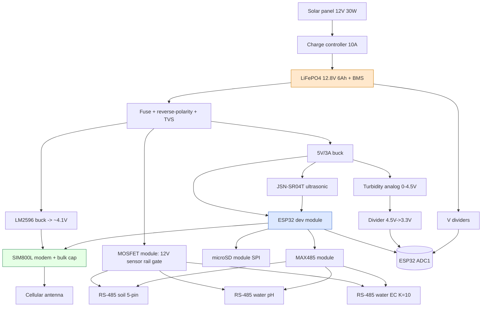
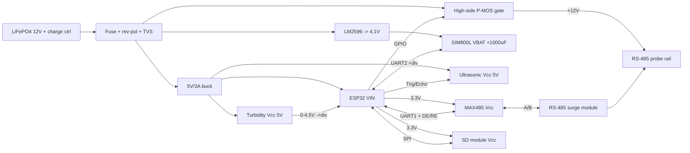

# Sundarbans Water & Soil Monitoring Station
### System & Hardware Design Specification (Build Spec)

**Project:** `Water_Soil_Sensor_Station_IoT_Device`
**Document type:** Development-focused build spec (system → circuit → PCB → firmware)
**Status:** Draft v0.2 — 2026-08-27 — **reconciled with your actual BOM**
**Audience:** Build team (firmware, hardware/PCB, field deployment)

> **This version matches the parts you've bought/planned** (BOM you provided 2026-08-27). Key consequences vs. a generic design:
> - **Connectivity is cellular-only (SIM800L / 2G GPRS).** There is no LoRa radio and no gateway tier — each node talks straight to the cloud over GPRS.
> - **Water level is ultrasonic** (JSN-SR04T), not a 4–20 mA pressure transducer.
> - **RS-485 is a non-isolated MAX485 module**, protected by your external RS-485 surge module (not an isolated transceiver).
> - **Turbidity is analog (0–4.5 V)** read by the ESP32's own ADC — no separate precision ADC.
> - **No RTC part in the BOM** → timestamps come from the cellular network (SIM800L `AT+CCLK`).
>
> §5 lists your BOM verbatim with per-line engineering notes and the issues I found. Where I recommend a change or an add, it's flagged **⚠ ISSUE** or **➕ SUGGESTED ADD**.

---

## Table of Contents

1. [Overview & Goals](#1-overview--goals)
2. [What It Measures](#2-what-it-measures)
3. [System Architecture & Data Flow](#3-system-architecture--data-flow)
4. [Requirements & Constraints](#4-requirements--constraints)
5. [Bill of Materials — your parts + notes](#5-bill-of-materials--your-parts--notes)
6. [Sensor Subsystem](#6-sensor-subsystem)
7. [Compute / MCU Subsystem](#7-compute--mcu-subsystem)
8. [Connectivity Subsystem (SIM800L / GPRS)](#8-connectivity-subsystem-sim800l--gprs)
9. [Power Subsystem](#9-power-subsystem)
10. [Signal Conditioning & Protection](#10-signal-conditioning--protection)
11. [Detailed Wiring / Interconnect (prototype)](#11-detailed-wiring--interconnect-prototype)
12. [PCB Design (modules → custom board)](#12-pcb-design-modules--custom-board)
13. [Enclosure & Mechanical](#13-enclosure--mechanical)
14. [Firmware Architecture](#14-firmware-architecture)
15. [Cloud, Dashboard & Alerts](#15-cloud-dashboard--alerts)
16. [Development Roadmap](#16-development-roadmap)
17. [Open Decisions](#17-open-decisions)
18. [Field Risks & Mitigations](#18-field-risks--mitigations)

---

## 1. Overview & Goals

### 1.1 What this is

A **solar-powered, off-grid environmental monitoring station** that measures water quality/level and soil condition in the Sundarbans mangrove belt and sends readings over the **cellular (2G/GPRS) network** directly to a cloud backend, with local SD-card logging as a backup and a dashboard with threshold alerts.

Each station is a single weatherproof enclosure holding the ESP32 + SIM800L electronics, powered by a 30 W solar panel and a 12 V LiFePO4 battery via a charge controller, with sensor cables running out through sealed glands to the water and soil.

### 1.2 Why (mission context)

The Sundarbans is under pressure from **salinity intrusion, tidal variation, sea-level rise, and soil salinization**. This station provides continuous, timestamped data on the parameters that matter for mangrove health, aquaculture, and coastal agriculture — data otherwise collected manually and sparsely.

### 1.3 Design goals (ranked)

1. **Survivability.** Salt, condensing humidity, heat, tidal exposure of probes, UV, and biofouling. The electronics must last 12+ months between service visits.
2. **Energy autonomy.** No grid. Run indefinitely on solar + battery, including cloudy monsoon spells.
3. **Reach.** Works from remote sites using the existing cellular network (2G/GPRS) — no local WiFi needed.
4. **Data integrity.** Every reading is timestamped and logged to SD before transmit; unsent rows are retried (store-and-forward).
5. **Serviceability.** Field-replaceable sensors on glanded cables; recoverable/updatable firmware.
6. **Buildable now, upgradeable later.** Prototype from the modules you already have; migrate to a consolidated custom PCB (§12) once the design is proven.

### 1.4 Two build phases

This spec deliberately covers both:

- **Phase A — Module prototype (build now):** ESP32 dev board + SIM800L module + MAX485 module + SD module + buck modules + MOSFET module, wired per §11. Gets you to a working field pilot fast with parts in hand.
- **Phase B — Custom PCB (productionize):** the same architecture consolidated onto one conformal-coated board with the chip-level equivalents, proper protection, and connectors (§12). This is where the "circuit + PCB design" detail lands.

---

## 2. What It Measures

Two probe clusters: a **water package** (submerged/near-surface) and a **soil package** (buried in the root zone), plus **housekeeping** telemetry from inside the enclosure.

### 2.1 Water parameters

| Parameter | Typical range (mangrove) | Sensor (your BOM) | Interface |
|---|---|---|---|
| Water level / depth | 0–5 m (tidal) | JSN-SR04T-V3.3 **ultrasonic** (distance to surface) | Trigger/Echo GPIO (or UART mode) |
| Salinity / EC | 0.5–50 mS/cm | RS-485 EC/TDS/salinity probe, **K=10 high-range**, IP68 *(pending)* | RS-485 Modbus |
| pH | 6.0–9.0 | RS-485 pH probe, IP68, factory-cal, ATC *(pending)* | RS-485 Modbus |
| Temperature (water) | 10–40 °C | From the RS-485 EC/pH probe | RS-485 Modbus |
| Turbidity | 0–1000 NTU | Optical turbidity module, **analog 0–4.5 V** | ESP32 ADC (via divider) |

> Water level via ultrasonic means the sensor is mounted **above** the maximum water line and measures the air gap to the surface; water level = `mount_height − measured_distance`. See §6.3 for mounting and dead-zone constraints.

### 2.2 Soil parameters

| Parameter | Typical range | Sensor (your BOM) | Interface |
|---|---|---|---|
| Volumetric water content (humidity) | 0–100 % | RS-485 5-pin soil probe | RS-485 Modbus |
| Soil temperature | 5–45 °C | RS-485 5-pin soil probe | RS-485 Modbus |
| Soil EC / salinity | 0–20 mS/cm | RS-485 5-pin soil probe | RS-485 Modbus |
| Soil pH | 3.5–9.0 | RS-485 5-pin soil probe | RS-485 Modbus |
| N / P / K *(indicative)* | relative | RS-485 5-pin soil probe | RS-485 Modbus |

> **⚠ Interpret NPK as trend-only.** In saline Sundarbans soil, EC-based NPK estimation is inflated by Na⁺/Cl⁻ ions (as your BOM note says). Report raw values but don't treat them as agronomic-grade.

### 2.3 Housekeeping (no extra sensors needed)

Battery voltage and solar voltage via resistor dividers into spare ESP32 ADC channels; cellular signal quality (`AT+CSQ` RSSI); optionally enclosure temp/RH if you add an SHT31 (**➕ suggested** — helps diagnose condensation).

> **Not measured (no sensor in BOM):** dissolved oxygen, ORP. Add an RS-485 optical DO probe later if needed — the RS-485 bus and firmware already support one more Modbus slave.

---

## 3. System Architecture & Data Flow

### 3.1 Two-tier architecture (cellular)

```
   TIER 1: FIELD NODE                              TIER 2: CLOUD
 ┌───────────────────────────────┐              ┌───────────────────────────┐
 │ Sensors (RS-485 + ultrasonic  │              │ MQTT broker / HTTP endpoint│
 │   + analog turbidity)         │   2G/GPRS    │   → Time-series database   │
 │ → ESP32 (Modbus master, ADC)  │──────────────▶│   → Dashboard (Grafana)   │
 │ → SD log (store & forward)    │  TCP/MQTT    │   → Threshold alerts       │
 │ → SIM800L modem + antenna     │  over cellular│                           │
 │ → Solar + LiFePO4 + charge ctl│              │                            │
 └───────────────────────────────┘              └───────────────────────────┘
        one node = one SIM                            web / mobile
```

No gateway tier: each node has its own SIM and reaches the internet directly. This is simpler than LoRaWAN but puts a **recurring SIM/data cost and a 2G-coverage dependency** on every node (§18).

### 3.2 Node block diagram



### 3.3 End-to-end data flow (one measurement cycle)

1. **Wake** from ESP32 deep sleep on the timer (default every 15 min).
2. **Power sensors:** MCU turns on the gated 12 V RS-485 rail and the 5 V analog/ultrasonic rail; wait sensor warm-up (~2–10 s).
3. **Acquire:**
   - MCU is **Modbus-RTU master** over MAX485 → polls soil, water-pH, water-EC probes by address.
   - **Ultrasonic** distance via Trigger/Echo (median of N pings) → convert to water level.
   - **Turbidity** analog via divider → ESP32 ADC1 (averaged).
   - Housekeeping: battery/solar divider voltages, `AT+CSQ` signal.
4. **Get time:** read network time from SIM800L (`AT+CCLK`) once cellular is attached; tag the record.
5. **Log** the record to SD (CSV) — this is the source of truth even if the link fails.
6. **Transmit:** open GPRS, publish the record (and any backlog) via MQTT/HTTP; confirm.
7. **Sleep:** turn off sensor rails, power down/sleep the modem, re-arm the timer, deep sleep.

### 3.4 Timing & current per phase (indicative, Phase A modules)

| Phase | Duration | Node current (from battery) |
|---|---|---|
| Deep sleep | ~15 min | **1–15 mA** (dev-board + modem sleep — see §9.4 ⚠) |
| Sensor warm-up | 2–10 s | 150–400 mA |
| Acquisition | 2–5 s | 100–200 mA |
| GPRS attach + publish | 5–20 s | avg 150–300 mA, **peaks ~2 A** (SIM800L TX) |
| Log + housekeeping | <1 s | ~80 mA |

The sleep-current line is the one to fight; §9.4 recomputes autonomy and lists ways to cut it.

---

## 4. Requirements & Constraints

### 4.1 Functional requirements

| ID | Requirement |
|---|---|
| F-1 | Measure §2 parameters at a configurable interval (default 15 min). |
| F-2 | Timestamp every record from cellular network time (`AT+CCLK`); hold time across a cycle with the ESP32 internal RTC. |
| F-3 | Log every record to SD before transmit. |
| F-4 | Transmit records to the cloud over GPRS (MQTT preferred; HTTP fallback). |
| F-5 | Queue unsent records on SD and backfill when the link recovers. |
| F-6 | Report housekeeping (battery V, solar V, CSQ signal, uptime, reset cause). |
| F-7 | Allow interval/threshold reconfiguration (downlink message or on-site). |
| F-8 | Recover automatically from hangs (watchdog) and from modem lock-ups (power-cycle the SIM800L). |

### 4.2 Non-functional constraints

| ID | Constraint | Target |
|---|---|---|
| N-1 | Power autonomy with no solar | ≥ 10 days |
| N-2 | Node deep-sleep current | as low as practical (module reality ≈ few mA; §9.4) |
| N-3 | Ingress protection (enclosure) | IP66 / IP67 |
| N-4 | Operating temperature | −5 to +60 °C electronics; 0–45 °C typical ambient |
| N-5 | Humidity | 0–100 % RH condensing (vent + desiccant + conformal coat) |
| N-6 | Connectivity | 2G/GPRS coverage at site (⚠ single dependency — §18) |
| N-7 | Service interval | ≥ 12 months (excl. calibration/biofouling cleaning) |
| N-8 | Corrosion resistance | marine-grade cable, sealed glands, no exposed ferrous metal |

### 4.3 Regulatory / network note

SIM800L is **2G GSM/GPRS only**. Confirm the deployment carrier (Grameenphone / Robi / Banglalink) still provides **2G coverage at the exact site** and that the SIM is provisioned for data on 2G. If 2G is unavailable/being retired locally, the whole comms path fails — see §17 (decision) and §18 (risk).

---

## 5. Bill of Materials — your parts + notes

Your BOM reproduced with per-line engineering notes. **⚠ ISSUE** = something to fix/verify before it bites you; **➕ SUGGESTED ADD** = small parts not on the list that the design needs.

### 5.1 Core & Cellular

| # | Item | Status | Notes / flags |
|---|---|---|---|
| 1 | ESP32 Dev Module (NodeMCU 30-pin) | Have | Fine for Phase A. ⚠ Onboard AMS1117 regulator + USB-serial chip + LEDs raise sleep current to the **mA** range — hurts autonomy (§9.4). The enclosure note mentions a **LILYGO board**: if that's a LILYGO **T-Call (ESP32+SIM800L)**, it already solves the modem's 4 V supply + level shifting — decide which you're using (§17). |
| 2 | SIM800L Mini GPRS | Have | ⚠ **2G only** (coverage dependency, §4.3/§18). ⚠ **VBAT = 3.4–4.4 V, not 5 V** — feed from the LM2596 set to ~4.1 V. ⚠ **2 A current bursts** → needs bulk cap + thick wiring or it browns out the ESP32 (§8, §9). |
| 3 | microSD module (SPI) | Have | OK. Level is 3.3 V logic — good for ESP32. Pull-ups on MISO/CS. |
| 4 | 16/32 GB microSD | Have | 16 GB is plenty. Use industrial/high-endurance grade if available (field heat + many writes). |
| 5 | MAX485 module | Have | ⚠ **Non-isolated.** Your surge module (#21) + TVS + fail-safe bias make this acceptable; note isolation (ADM2582E) as a Phase-B upgrade if ground loops appear (§10.1). |
| 6 | 120 Ω termination resistors (1206) | No | Two needed on the bus (one at each physical end). |
| 7 | 470 µF 16 V caps | No | ➕ Get at least one **1000 µF low-ESR** for SIM800L VBAT specifically; 470 µF is marginal for 2 A bursts. |
| 8 | LM2596 buck (w/ display) | Have | **Use this as the SIM800L 4.1 V supply** (the display makes setting the voltage easy). Set once, verify under load. |
| 9 | 5 V/3 A buck module | Have | Powers ESP32 (VIN) + 5 V sensors (ultrasonic, turbidity). |

### 5.2 Soil & Water Sensors

| # | Item | Status | Notes / flags |
|---|---|---|---|
| — | Soil RS-485 5-pin (pH/NPK/temp/humidity/EC) | Have | ⚠ Treat **NPK as relative trend only** in saline soil. Confirm baud/registers from vendor Modbus map. |
| — | JSN-SR04T-V3.3 ultrasonic | Have | Water level = mount height − distance. ⚠ ~25 cm **dead zone**, ~4.5 m max, wide beam — mounting matters (§6.3). Temperature affects speed of sound — compensate. |
| — | 4–20 mA→RS-485 ADC converter | **Skip** | Correctly dropped — level is ultrasonic and turbidity is analog-into-ESP32. Not needed. |
| — | RS-485 water pH probe (IP68, ATC) | Pending | Buy IP68 factory-calibrated with ATC. Assign a unique Modbus address. |
| — | RS-485 water EC/salinity probe **K=10** (IP68) | Pending | ✔ K=10 high-range is right for brackish/tidal water (K=1 saturates). |
| — | Optical turbidity probe, **analog 0–4.5 V** | Have | ⚠ Output exceeds ESP32's 3.3 V ADC → **needs a divider** (§10.3). ⚠ The basic module isn't IP68 — pot/seal it for submersion. |

### 5.3 Power, Solar & Sleep Control

| # | Item | Status | Notes / flags |
|---|---|---|---|
| — | 12 V 30 W mono solar panel | No | Well-sized; effectively oversized vs. load (good margin, §9.4). |
| — | 12 V **6 Ah** LiFePO4 + BMS | No | ⚠ Gives ~7–10 days autonomy depending on sleep current (§9.4). Consider **12 Ah** for comfortable margin. Tropical site → no low-temp-charge issue. |
| — | 12 V PWM/MPPT charge controller, 10 A | No | Off-the-shelf is fine. ⚠ Set to the **LiFePO4 profile** if it has one (≈14.4–14.6 V absorb, 13.6 V float); many cheap PWM units are lead-acid-only — check. ⚠ Its own quiescent draw (mA) counts against autonomy. |
| — | MOSFET switch module (IRF520 / IRLZ44N) | Have | ⚠ **IRF520 is not logic-level** (won't fully turn on at a 3.3 V gate). Use **IRLZ44N** or drive the gate at 5 V. ⚠ Module is **low-side** — for a shared-ground RS-485 rail, prefer **high-side** switching of +12 V (§9.3 gives the circuit). |

### 5.4 Enclosure & Mechanical

| # | Item | Status | Notes / flags |
|---|---|---|---|
| — | IP67 box 158×90×65 mm, clear lid | No | ⚠ **Tight** with a 6 Ah battery + ESP32 + SIM800L + MAX485 + bucks + MOSFET inside. Mock up the fit; consider a larger box or an **external battery box**. Clear lid + sun = internal heating; consider opaque/UV-stable or shade. |
| — | IP68 cable glands PG7/PG9 | No | One per cable entry (RS-485 bus, ultrasonic, turbidity, solar leads, antenna). |
| — | Shielded 4-core twisted-pair, 15 m | No | A/B + 12 V + GND per run. Ground shield at **one end only** (enclosure). |
| — | Flexible PVC conduit | No | Protects submerged cable from tidal abrasion/mud. |
| — | Silica-gel desiccant | No | Manages condensation. Pair with a Gore-type breather vent (➕ suggested). |
| — | RS-485 surge/lightning module (TVS, 10 kA) | No | ✔ Important given non-isolated MAX485 + monsoon lightning. Also protect the **antenna line** (§8.4). |

### 5.5 Calibration & Consumables

| # | Item | Status | Notes / flags |
|---|---|---|---|
| — | EC calibration standard 1413 µS/cm | No | ➕ For a **K=10 brackish probe** also get a **high-range standard (e.g., 12.88 mS/cm)** — 1413 µS/cm alone won't calibrate the salt range you'll actually see. |
| — | 4G/LTE nano SIM + data plan | Have | ⚠ Physically fine, but SIM800L uses it on **2G only** — verify the plan/APN works on 2G. |

### 5.6 Suggested small adds (not on your list)

| Part | Why |
|---|---|
| 1000 µF low-ESR cap | SIM800L 2 A burst hold-up (prevents ESP32 brownout) |
| Resistors for dividers (turbidity, battery, solar sense) + level-shift on SIM RX | Analog scaling + 3.3 V↔2.8 V serial (§10) |
| Logic-level FET (IRLZ44N) or P-MOS + 2N7002 for high-side gate | Reliable sensor-rail gating (§9.3) |
| SMBJ TVS (battery input) + SM712 TVS (RS-485) + inline fuse (3–5 A) | Board-level protection (§10.5) |
| SHT31 (I²C) — optional | Enclosure temp/RH to diagnose condensation |
| DS3231 RTC — optional | Backup timekeeping if network time is unreliable (§7.4) |
| Gore-type breather vent | Pressure/condensation management in a sealed box |

---

## 6. Sensor Subsystem

### 6.1 RS-485 / Modbus bus (soil + water pH + water EC)

All three digital probes share **one bus**: A/B differential pair + a switched **+12 V** and **GND**, wired in the 4-core shielded cable. The ESP32 is the **Modbus-RTU master** via the MAX485 module.

- **Addressing:** give each probe a **unique Modbus slave address** (e.g., soil = 0x01, water-pH = 0x02, water-EC = 0x03). Set/verify addresses on the bench with a USB-RS485 dongle before deployment; record them on a label inside the lid.
- **Frame:** typical for these probes is **9600 (or 4800) baud, 8N1**, function `0x03` (read holding registers). Pull each probe's **register map** from its datasheet — register addresses/scaling differ by vendor.
- **Termination:** 120 Ω across A/B at the **two physical ends** of the bus only (#6 resistors). If one probe is on a long single run, that far end gets one 120 Ω; the board end gets the other.
- **Fail-safe bias:** add a pull-up on A and pull-down on B (≈560–680 Ω to 3.3 V / GND) so the idle bus reads a defined state (§10.1).
- **Direction:** tie MAX485 `DE`+`RE` together to one ESP32 GPIO; keep it in receive except while transmitting a Modbus request.

### 6.2 Turbidity (analog)

- Powered from the 5 V rail; output is **0–4.5 V** (higher voltage = clearer water; the response is inverse and non-linear — calibrate).
- **Must be divided** to ≤3.3 V before the ESP32 ADC (§10.3), read on an **ADC1** pin.
- Average many samples (e.g., 50–100) and take the median to beat ADC noise; calibrate against known references (clear water = high V; a turbidity standard or stirred-sediment reference = low V).
- ⚠ The basic module PCB is not submersible — only the optical probe head should contact water; pot/seal the electronics or house them in the enclosure with just the probe on a cable.

### 6.3 Ultrasonic level (JSN-SR04T-V3.3)

- Mount the transducer **above the maximum tide line**, pointing straight down at the water; compute `level = mount_height − distance`.
- ⚠ **Dead zone ≈ 20–25 cm** (readings closer than that are invalid) and **max range ≈ 4.5 m** — set the mount height so the operating range sits comfortably inside that window.
- ⚠ **Temperature compensation:** speed of sound changes ~0.6 m/s per °C. Use an available temperature reading (soil probe air temp, or an added sensor) to correct distance, or accept ~2–3 % error across the day.
- Beam is wide (~60°): keep the cone clear of pilings, banks, and floating debris; a stilling well (a vertical perforated pipe) greatly steadies readings in choppy/foaming tidal water.
- Interface: default **Trigger/Echo** (two GPIO). The module can be set to **UART mode** (mode-select resistor) — UART is more noise-robust over the cable run; choose per your wiring.

---

## 7. Compute / MCU Subsystem

### 7.1 ESP32 dev module — role & power

The ESP32 runs everything: Modbus master, ultrasonic timing, ADC sampling, SD logging, SIM800L control, sleep scheduling.

- **Power:** feed the dev board's **5 V/VIN** from the 5 V/3 A buck; the onboard AMS1117 makes the 3.3 V logic rail (also powering MAX485 logic side, SD module, dividers).
- **Deep sleep:** use `esp_deep_sleep` with a timer wake. ⚠ On a stock dev board, the AMS1117 + CP2102 + power LED keep sleep current in the **mA** range; see §9.4 for the autonomy impact and how to cut it.
- **ADC:** use **ADC1** pins (GPIO 32–39) for turbidity + battery/solar sense. ⚠ **ADC2 is unusable while WiFi is active** — but since this design keeps WiFi off in the field, that's mainly a bench caveat; still prefer ADC1.

### 7.2 Peripheral / GPIO map (indicative)

| Function | Interface | Notes |
|---|---|---|
| SIM800L | UART2 (TX/RX) + PWRKEY + RST + STATUS | RX needs 3.3 V→~2.8 V divider/level shift (§8.2) |
| MAX485 (RS-485) | UART1 (TX/RX) + DE/RE (1 GPIO) | Hardware UART, not SoftwareSerial, for reliable Modbus timing |
| microSD | SPI (SCK/MOSI/MISO/CS) | Dedicated CS; keep bus short |
| Ultrasonic | Trigger + Echo GPIO (or UART) | Echo is 3.3 V on the V3.3 variant |
| Turbidity / VBAT / VSOLAR | ADC1 GPIOs | Via dividers (§10) |
| Rail enables | GPIO → MOSFET gate(s) | 12 V sensor rail, optionally 5 V sensor rail |
| Watchdog | firmware task WDT + power-cycle logic | Also power-cycle SIM800L on modem hang (§14) |

### 7.3 Storage & store-and-forward

microSD holds a rolling CSV log (source of truth). Each row: timestamp, node ID, all parameters, housekeeping, and a **sent/unsent flag**. On a successful GPRS publish, mark rows sent; on the next cycle, re-send any unsent rows (backfill).

### 7.4 Timekeeping (no RTC in BOM)

- **Primary:** read network time from SIM800L (`AT+CCLK?`, enabled via NITZ) after cellular attach; use it to timestamp records.
- **Across a sleep cycle:** the ESP32 internal RTC holds time well enough for one 15-min interval; re-sync from the network each cycle.
- ⚠ If the modem fails to attach, timestamps drift. **➕ Optional DS3231** gives robust battery-backed time independent of the network — worth adding if data timing is critical.

> **If you adopt a LILYGO T-Call:** the SIM800L supply, level shifting, and (on some variants) charging are already on the board — §8.2 wiring is largely done for you, and you'd mainly add the RS-485, SD, and sensor front ends. Decide this early (§17) since it changes the wiring in §11.

---

## 8. Connectivity Subsystem (SIM800L / GPRS)

The SIM800L is the single most failure-prone part of this build — most "random reboot / won't connect" problems trace back to **power** and **logic levels**. Get §8.1–8.2 right first.

### 8.1 Power (the #1 gotcha)

- **VBAT = 3.4–4.4 V**, target **~4.0–4.1 V**. Feed it from the **LM2596** (set with its display, verified under load) — *not* the 5 V rail.
- **Bursts to ~2 A** during GSM transmit (2G TDMA sends in bursts). A slow buck alone will sag and the ESP32 will brown-out/reset. Mitigate:
  - **≥1000 µF low-ESR** electrolytic **right at** SIM800L VBAT/GND (add your 470 µF in parallel; more is better).
  - Short, thick VBAT and GND wiring (bursts are high di/dt).
  - Keep the SIM800L on its **own buck (LM2596)**, separate from the ESP32's 5 V buck, so modem bursts don't drag the MCU rail.
- Optionally gate the modem off entirely between cycles (via a high-side switch) to save its idle current — but re-attaching to the network each cycle costs time/energy; usually cheaper to let it sleep (`AT+CSCLK`) than fully power-cycle every 15 min. Tune during pilot.

### 8.2 Logic levels & control

- SIM800L I/O is ~2.8 V logic and its **RXD is not reliably 5 V-tolerant**. ESP32 drives 3.3 V:
  - **ESP32 TX → SIM RXD:** drop 3.3 V → ~2.8 V with a divider (e.g., 2.2 kΩ series + 3.3 kΩ to GND) or a level shifter.
  - **SIM TXD → ESP32 RX:** ~2.8 V reads as logic-high on the ESP32 — direct connection is fine.
- **Control lines:** `PWRKEY` (pulse low ~1 s to toggle power state), `RST` (hardware reset), `STATUS`/`NETLIGHT` (monitor attach state — the NETLIGHT blink rate tells you registered vs. searching).
- Common ground between ESP32 and SIM800L (they share the board GND / battery-negative reference).

### 8.3 Firmware/protocol stack

- Library: **TinyGSM** (SIM800 profile) for the AT-command/GPRS layer.
- Transport: **MQTT** via **PubSubClient** over TinyGSM's `TinyGsmClient` (publish JSON/binary to a topic like `sundarbans/<nodeID>/data`). HTTP POST is an acceptable fallback if you prefer a simple REST endpoint or ThingSpeak.
- **APN:** set the carrier APN (e.g., `gpinternet` / `internet` — confirm per SIM). Store APN + broker creds in a config the firmware can update.
- **Network time:** enable NITZ and read `AT+CCLK?` for timestamps (§7.4).
- **Signal:** log `AT+CSQ` (RSSI) each cycle — invaluable for diagnosing marginal sites.

### 8.4 Antenna & surge

- Use a proper **external GSM antenna** on a glanded feed, mounted high — the tiny helical/PCB antennas that ship with SIM800L modules are poor and will hurt attach reliability at a fringe site.
- ⚠ **Protect the antenna feed** against induced surge (your surge module note calls this out): an inline GSM surge arrestor / GDT at the bulkhead. A tall antenna on a pole is a lightning target (§18).

### 8.5 2G dependency (design-level risk)

The entire uplink depends on 2G being alive at the site. Mitigations: confirm 2G coverage on site before deploying; keep SD logging so no data is lost during outages (backfill on reconnect); design the PCB (§12) with a **footprint that also fits an LTE Cat-1/NB-IoT modem (e.g., A7670/SIM7000)** so a future board revision can drop-in replace 2G without a redesign.

---

## 9. Power Subsystem

### 9.1 Topology (your parts)

```
Solar 12V/30W ─▶ Charge controller (10A) ─▶ LiFePO4 12.8V/6Ah (+BMS) ─┬─▶ [Fuse + reverse-pol + TVS] ─▶ VBATT bus (~12–14.6V)
                                                                       │
                                                                       ├─▶ LM2596  ─▶ ~4.1V ─▶ SIM800L (+1000µF bulk)
                                                                       ├─▶ 5V/3A buck ─▶ 5V ─▶ ESP32 VIN + turbidity + ultrasonic
                                                                       │                         └▶ (ESP32 AMS1117) ─▶ 3.3V ─▶ MAX485 logic, SD, dividers
                                                                       └─▶ [High-side gate] ─▶ +12V sensor rail ─▶ RS-485 probes
```

The **charge controller** (off-the-shelf) owns solar→battery. The board takes **battery 12 V in** and derives the rails. Keep the battery's **BMS over-discharge cutoff** as the last line of defense, but design so the node sleeps long before that.

### 9.2 Rail summary

| Rail | Source | Feeds | Notes |
|---|---|---|---|
| ~4.1 V | LM2596 | SIM800L VBAT | Big bulk cap; separate from MCU rail |
| 5 V | 5 V/3 A buck | ESP32 VIN, turbidity, ultrasonic | 3 A headroom covers inrush |
| 3.3 V | ESP32 onboard AMS1117 | MAX485 logic, SD, dividers | Watch AMS1117 idle draw (§9.4) |
| +12 V (gated) | VBATT via high-side switch | RS-485 probes | Verify each probe accepts 12–14.6 V |

### 9.3 Sensor-rail gating (do this properly)

Your MOSFET module is a **low-side IRF520** board. Two problems for this job: (1) **IRF520 isn't logic-level** — a 3.3 V gate won't fully turn it on; (2) **low-side switching** breaks the shared ground that the RS-485 bus needs. Recommended instead — a **high-side P-MOS switch** for the +12 V probe rail:

```
        +12V (VBATT)
          │
        ┌─┴─┐  P-MOS (e.g., AO3401 for <~4A, or IRF9540 for higher)
   ┌────┤S  │
   │    │   ├── D ──▶ +12V sensor rail (to probes)
   │    └─┬─┘
   │      │ G
  10k     ├───────┐
   │      │      10k
   └──────┘       │
   (Rgs pulls   [2N7002 N-FET]  gate G ◀── ESP32 GPIO (3.3V, HIGH = rail ON)
    gate to      S=GND
    +12V=OFF)
```

- ESP32 GPIO high → 2N7002 pulls the P-MOS gate low → P-MOS conducts → +12 V rail ON. GPIO low → P-MOS off → rail OFF (probes unpowered, zero standby).
- Keeps **probe GND common** with board GND, so RS-485 works. Add a soft-start cap on the gate to limit inrush into probe input caps.
- If you insist on using the IRLZ44N/low-side module, switch only a **dedicated power-ground** for probes that do **not** share the RS-485 signal ground — messy; the high-side approach above is cleaner and preferred.

### 9.4 Power budget & autonomy (6 Ah reality)

**Usable energy:** 12.8 V × 6 Ah = **~77 Wh**; hold to ~80 % depth-of-discharge for LiFePO4 longevity → **~60 Wh usable**.

**Daily consumption (estimate, Phase A modules, 96 cycles/day @ 15 min):**

| Contributor | Estimate |
|---|---|
| Sleep/idle: ESP32 dev board + SIM800L sleep + charge-controller quiescent | ~10–20 mA avg from battery → **~3–6 Wh/day** |
| Active cycles: warm-up + acquire + GPRS publish (incl. 2 A bursts) | **~1.5–2.5 Wh/day** |
| Conversion losses / margin | **~1 Wh/day** |
| **Total** | **≈ 6–9 Wh/day** |

**Autonomy (no sun):** 60 Wh ÷ (6–9 Wh/day) = **~7–10 days**. This **meets the 10-day target only at the low end** and is dominated by *sleep* current.

**Solar recharge:** a 30 W panel yields ~60–120 Wh on a good day, ~10–25 Wh on a poor monsoon day — comfortably replaces 6–9 Wh/day. **Sun is not the constraint; the battery ride-through during a no-sun stretch is.**

**To get comfortable margin, do one or more of:**
1. **Cut sleep current** — biggest lever. Options: use a **bare ESP32-WROOM module** (Phase B) instead of the dev board; on the dev board, remove/disable the **power LED** and (if not needed) the **USB-serial chip**; put SIM800L into **sleep mode** (`AT+CSCLK=2`) or gate it; pick a **charge controller with low self-consumption**.
2. **Bump the battery to 12 Ah** — roughly doubles ride-through for a small cost/size increase (check enclosure fit — §13).
3. **Lengthen the interval** (e.g., 30–60 min) if the science allows — near-linear reduction in active energy.

> Re-measure the *actual* sleep current of your assembled node with a multimeter/µCurrent before finalizing the battery — module sleep current varies widely and is the single biggest unknown here.

---

## 10. Signal Conditioning & Protection

Every wire leaving the enclosure gets **series resistance → TVS clamp → receiver**, plus your inline surge module on the RS-485 bus.

### 10.1 RS-485 (MAX485, non-isolated)

- **Fail-safe bias:** pull-up on A (to 3.3 V) and pull-down on B (to GND), ≈560–680 Ω, so an undriven bus reads a defined idle. (Some MAX485 modules include bias resistors — check yours before adding.)
- **Termination:** 120 Ω at each physical bus end (§6.1).
- **Surge:** your **RS-485 surge module (#21)** goes inline at the cable entry (gland side). Additionally place an **SM712 bidirectional TVS** across A/B on the board for fast clamping, plus **10 Ω series** on A and B.
- **Grounding:** cable shield to enclosure ground at the **board end only** (avoid ground loops). Non-isolated MAX485 means probe grounds tie to board ground — acceptable with the surge + TVS protection; if you later see noise/latch-ups, upgrade to an **isolated transceiver (ADM2582E)** in Phase B.

### 10.2 Battery/solar voltage sense

- Divider into ADC1: for a ~15 V max input to a 3.3 V ADC, ratio ≈ 0.2, e.g., **R1 = 100 kΩ (top), R2 = 27 kΩ (bottom)** → 15 V × 0.213 ≈ 3.2 V. Add a 100 nF cap at the tap.
- Use the ESP32 ADC **11 dB attenuation** (0–~3.3 V range) and calibrate the divider ratio in firmware.
- High-value resistors keep divider current negligible for the power budget.

### 10.3 Turbidity divider

- Scale 0–4.5 V → ≤3.3 V: ratio ≈ 0.66, e.g., **R1 = 10 kΩ (series), R2 = 20 kΩ (to GND)** → 4.5 V × 0.667 ≈ 3.0 V (headroom below 3.3 V).
- Add an **RC low-pass** (e.g., 1 kΩ + 100 nF at the ADC pin) and oversample/median in firmware. Calibrate output↔NTU against references.

### 10.4 SIM800L brown-out mitigation (again, because it matters)

- Bulk cap at VBAT (§8.1); separate modem buck; thick/short power wiring.
- Consider **lowering/disabling the ESP32 brown-out detector** threshold in firmware if benign resets persist *after* the power fixes — but treat that as a last resort; fix the supply first.

### 10.5 Board-level protection summary

| Threat | Mitigation (your parts + suggested adds) |
|---|---|
| Reverse battery polarity | Series **P-MOS ideal-diode** (or a Schottky for simplicity) on battery input |
| Over-current / short | Inline **fuse 3–5 A** (+ optional resettable PTC) on VBATT |
| Surge / lightning (cables, antenna) | **RS-485 surge module (#21)** + SM712 on A/B; **GSM surge arrestor** on antenna; **SMBJ TVS** across VBATT |
| ESD on connectors | Low-cap ESD diodes on exposed data lines |
| Modem burst brown-out | Bulk cap + separate buck (§8.1) |
| Firmware/modem hang | Watchdog + SIM800L power-cycle logic (§14) |
| Humidity leakage | Conformal coat the final board; desiccant + vent in the box (§13) |

---

## 11. Detailed Wiring / Interconnect (prototype)

This is the Phase-A "schematic" at the module level — how the parts you have wire together. Exact GPIOs are flexible; the **rules** matter more than the specific pins.

### 11.1 GPIO assignment (ESP32 30-pin, representative)

| ESP32 pin | Net | To | Notes |
|---|---|---|---|
| GPIO16 (RX2) | SIM_TX | SIM800L TXD | Direct (SIM ~2.8 V reads as high) |
| GPIO17 (TX2) | SIM_RX | SIM800L RXD **via divider** | 3.3 V→~2.8 V (2.2 k series / 3.3 k to GND) |
| GPIO4 | SIM_PWRKEY | SIM800L PWRKEY | Pulse low to toggle power |
| GPIO22 | SIM_RST | SIM800L RST | Hardware reset line |
| GPIO36 (input-only) | SIM_STATUS | SIM800L STATUS/NETLIGHT | Monitor attach state |
| GPIO27 | RS485_RO | MAX485 RO | UART1 RX (remapped) |
| GPIO14 | RS485_DI | MAX485 DI | UART1 TX (remapped) |
| GPIO13 | RS485_DE_RE | MAX485 DE+RE (tied) | High = transmit |
| GPIO18 | SD_SCK | microSD SCK | VSPI |
| GPIO19 | SD_MISO | microSD MISO | pull-up 47 k |
| GPIO23 | SD_MOSI | microSD MOSI | VSPI |
| GPIO21 | SD_CS | microSD CS | pull-up 47 k |
| GPIO26 | US_TRIG | JSN-SR04T Trig | 10 µs trigger pulse |
| GPIO25 | US_ECHO | JSN-SR04T Echo | 3.3 V on V3.3 variant |
| GPIO34 (input-only) | TURB_ADC | Turbidity **via divider** | ADC1; RC filter |
| GPIO35 (input-only) | VBAT_ADC | Battery divider | ADC1 |
| GPIO32 | VSOL_ADC | Solar divider | ADC1 |
| GPIO33 | SENS_EN | High-side gate driver (2N7002→P-MOS) | High = +12 V rail ON |

> **Pin rules:** avoid using **strapping pins (GPIO0, 2, 5, 12, 15)** for signals that would be held at the wrong level during boot; **GPIO34–39 are input-only** (sensors/ADC only, never outputs). If you add I²C (SHT31/DS3231), free two GPIO (e.g., relocate SD_CS) for SDA/SCL. If a stock UART1 pin conflicts with flash, remap with `HardwareSerial(1).begin(baud, SERIAL_8N1, RX, TX)` as above.

### 11.2 Module interconnect



### 11.3 External cable schedule (through glands)

| Cable | Conductors | Gland |
|---|---|---|
| RS-485 sensor bus (to soil + water pH + water EC) | A, B, +12 V, GND (shielded 4-core) | PG9 |
| Ultrasonic | Vcc, GND, Trig, Echo | PG9 |
| Turbidity | Vcc, GND, Signal | PG7 |
| Solar input | + , − | PG9 |
| GSM antenna | coax + bulkhead | (SMA bulkhead, not a gland) |

---

## 12. PCB Design (modules → custom board)

Phase B consolidates the modules onto one conformal-coated board. This is where reliability and low sleep current are won. Keep the SIM800L as a soldered-down module (it's an RF-certified assembly), but replace the dev board, MAX485 board, SD board, buck boards, and MOSFET board with their chip-level equivalents.

### 12.1 What changes from modules to chips

| Phase A module | Phase B on-board |
|---|---|
| ESP32 dev board | **ESP32-WROOM-32E** module + USB-UART (CP2102N) on a **programming header only** (or Tag-Connect), power/boot straps done right, **no always-on power LED** |
| MAX485 board | **MAX485 IC** (or **ADM2582E isolated** — recommended upgrade) + bias/term/TVS |
| SD board | microSD **push-pull socket** + pull-ups |
| Buck boards | **Dedicated buck ICs**: e.g., a 2 A buck to 5 V, an efficient buck to ~4.1 V for the modem; low-Iq LDO/buck for 3.3 V |
| MOSFET board | **Discrete high-side P-MOS** + 2N7002 driver (§9.3) |
| Voltage dividers on jumpers | On-board 1 % resistor dividers + RC |

### 12.2 Board partitioning

Lay the board out in zones, left-to-right by "dirtiness":

1. **Power-in / charge** (battery + solar terminals, fuse, reverse-polarity, TVS, bucks) — one corner, wide copper.
2. **Modem zone** — SIM800L with its **bulk cap right at VBAT**, its own ground pour, kept away from the ADC zone; antenna connector at the board edge.
3. **MCU zone** — ESP32-WROOM centrally, decoupling at every VCC pin, boot straps, programming header, keep-out under the module's own antenna if using the PCB-antenna variant (prefer the U.FL/ext-antenna variant here since it's in a metal-ish wet box).
4. **RS-485 + protection zone** — MAX485/ADM2582E hard against the sensor connector, with the surge/TVS/termination right at the connector so transients never reach the MCU.
5. **Analog zone** — turbidity + battery/solar dividers and RC filters, on a quiet ground region away from the modem.

### 12.3 Stack-up

- **Recommended: 4-layer** — `Signal / GND / PWR / Signal`. A continuous ground plane on layer 2 is the single biggest EMC/robustness win, and it tames SIM800L burst noise. ENIG finish (better for humidity/corrosion than HASL).
- **Acceptable: 2-layer** if cost-driven — then use a **large poured ground** on the bottom, **star-ground** the analog/ADC returns to a single point, keep the modem's high-current loop tight, and widen power traces (≥40–60 mil for the 2 A modem path).

### 12.4 Layout rules (the ones that matter here)

- **Modem bulk cap** within a few mm of SIM800L VBAT/GND; minimize the high-di/dt loop area.
- **Star/single-point ground** between analog return and power return; don't route ADC references across the modem ground.
- **Antenna:** short 50 Ω path to an **SMA/U.FL** connector; don't run a long RF trace across the board — use a pigtail to a bulkhead. Add the GSM surge arrestor footprint at the connector.
- **Protection at the edge:** all TVS/surge/series-R for external lines sit next to their connectors, before the signal reaches active parts.
- **Test points** on every rail (VBATT, 5 V, 4.1 V, 3.3 V), RS-485 A/B, and key GPIO — you'll thank yourself in the field.
- **Mounting:** 4× mounting holes, keep-outs for standoffs; connectors on one edge for clean cable dressing.
- **Footprint for future LTE modem** (A7670/SIM7000) in the modem zone so a 2G→LTE revision doesn't mean a new layout (§8.5).

### 12.5 Finish & assembly

- **Conformal coating** (acrylic or silicone) after assembly and test, masking connectors, the SD socket, and the antenna connector. This is essential in condensing humidity/salt.
- Prefer no exposed copper; generous soldermask; consider potting the most vulnerable connector areas.

---

## 13. Enclosure & Mechanical

### 13.1 Electronics box

- Your **IP67 158×90×65 mm** box holds the board + battery + modules. ⚠ **Verify the fit** — a 6 Ah LiFePO4 plus all modules is tight; if it doesn't fit cleanly, move the **battery to its own IP-rated box** and run a short power cable, or step up to a larger enclosure.
- **Clear lid + tropical sun = internal heating** and UV aging of the plastic. Mount under a small shade/sun-shield, or use an opaque UV-stable box; keep the solar panel separate on its own bracket.
- **Breather vent (Gore-type)** to equalize pressure (temperature swings pump humid air in/out of a sealed box) plus **silica-gel desiccant** inside. Replace/recharge desiccant at each service.
- **Mounting:** on a pole/platform above the maximum flood level; drip loops on all cables entering from below; glands pointing **down**.

### 13.2 Sensor mounting

- **Ultrasonic:** rigid bracket, transducer face horizontal pointing straight down, above the dead zone; a **stilling well** (vertical perforated PVC pipe) dramatically steadies readings in tidal/choppy/foamy water.
- **Soil probe:** bury in the root zone at a documented depth; backfill and firm the soil for good contact; strain-relieve the cable.
- **Water pH/EC probes:** suspend at a fixed depth in a protective PVC cage; keep out of bottom sludge; ensure the K=10 EC probe's cell isn't clogged.
- **Cable protection:** run submerged/exposed cable inside the **PVC conduit**; secure against tidal drag.

### 13.3 Corrosion & biofouling

- Marine-grade cable; **stainless or nylon** hardware only (no plain steel); **dielectric grease** on connector contacts.
- Biofouling will coat submerged optical/EC surfaces within weeks in warm brackish water. Mitigate with **periodic cleaning visits**, a **wiper-equipped probe** if budget allows, or **copper tape/mesh** guards near optical windows. Schedule calibration checks with cleaning.

---

## 14. Firmware Architecture

### 14.1 Main state machine (per wake cycle)

```
DEEP_SLEEP ──(timer)──▶ WAKE ▶ POWER_SENSORS(warm-up) ▶ READ_MODBUS(soil,pH,EC)
   ▲                                                          │
   │                                                          ▼
   └── SLEEP ◀ PUBLISH+BACKFILL ◀ CONNECT_GPRS ◀ LOG_SD ◀ READ_ULTRASONIC + READ_ADC(turbidity,V) + GET_TIME
```

Fail-safe transitions: any stage can time out → still **LOG_SD** (never lose a reading) → attempt publish → **SLEEP** regardless, so a stuck modem/probe never blocks the next cycle.

### 14.2 Libraries / stack

- **TinyGSM** (SIM800 profile) — GPRS/AT layer.
- **PubSubClient** over `TinyGsmClient` — MQTT publish (HTTP POST alternative).
- **ModbusMaster** (or a lightweight custom RTU master) — probe reads with **CRC validation** and per-probe timeouts.
- **SD / SdFat** — CSV logging + backlog.
- **esp_sleep** — deep sleep + RTC-memory retention of state (last time sync, unsent pointer, reset counters).

### 14.3 Robustness

- **Watchdog:** enable the ESP32 task WDT; feed it in the main loop. On repeated modem failure, **power-cycle the SIM800L** (PWRKEY/RST, or cut its rail) and retry with backoff.
- **Retry/backoff:** bounded retries for GPRS attach and publish; on failure, keep the record queued on SD and sleep — backfill next cycle.
- **Config:** interval, thresholds, APN, broker/topic, node ID in a **config file on SD** (or NVS). Support a **downlink** (MQTT subscribe or a config fetch on connect) to change interval/thresholds without a site visit.
- **Reset cause & counters** logged each boot for field diagnostics.

### 14.4 Data formats

- **CSV log row (SD):** `iso_time,node_id,soil_temp,soil_moist,soil_ph,soil_ec,soil_n,soil_p,soil_k,water_level_m,water_ph,water_ec_mScm,turbidity_ntu,vbat_v,vsol_v,csq,sent_flag`
- **MQTT payload (JSON):**

```json
{
  "node": "SBN-01",
  "t": "2026-08-27T09:15:00+06:00",
  "soil": {"temp": 28.4, "moist": 41.2, "ph": 6.8, "ec": 3.9, "n": 30, "p": 12, "k": 88},
  "water": {"level_m": 1.72, "ph": 7.6, "ec_mScm": 18.3, "turb_ntu": 240},
  "hk": {"vbat": 13.1, "vsol": 17.8, "csq": 14, "boot": 42, "rst": "TIMER"}
}
```

- **OTA:** full OTA over 2G/GPRS is slow and risky; plan **local USB/SWD updates** at service visits. If remote update is essential, implement a small, resumable, checksum-verified download and only over a strong signal.

---

## 15. Cloud, Dashboard & Alerts

### 15.1 Minimal viable path (fastest)

Publish to **ThingSpeak** or a hosted MQTT service and use its built-in charts. Good for the pilot; limited on alerting and schema flexibility.

### 15.2 Recommended stack

```
SIM800L ──MQTT──▶ Broker (Mosquitto on a small VPS) ──▶ Ingest/bridge ──▶ InfluxDB (time-series) ──▶ Grafana (dashboards + alerts)
```

- **Broker:** Mosquitto; one topic per node `sundarbans/<nodeID>/data`, plus `.../cmd` for downlink config.
- **Storage:** InfluxDB (or TimescaleDB) — natural fit for timestamped sensor series.
- **Dashboard:** Grafana panels for water level (tidal curve), salinity/EC trend, pH, turbidity, soil moisture/EC, and a **fleet health** panel (battery V, solar V, CSQ, last-seen).
- **Node registry:** a small table mapping node ID → GPS location, install date, sensor addresses, calibration dates.

### 15.3 Alerts

Grafana alert rules, e.g.: salinity above a threshold (intrusion event); water level outside expected tidal band; **battery voltage low** (< ~12.0 V for LiFePO4 under load); **station offline** (no data for N intervals — heartbeat/watchdog on the *server* side); turbidity spike.

### 15.4 Security note

SIM800L's TLS support is old/limited (weak ciphers). Options: publish over plain MQTT to a broker that only accepts known client IDs + credentials on a non-standard port (weak), or terminate TLS at a nearer gateway, or accept the risk for non-sensitive environmental data but at minimum use **unique credentials per node** and server-side validation. Don't send anything sensitive in the clear.

---

## 16. Development Roadmap

| Milestone | Goal | Exit criteria |
|---|---|---|
| **M1 — Bench bring-up** | Each module working alone | ESP32 deep-sleep + timer wake; SIM800L attaches and publishes a test MQTT msg; read one RS-485 probe with valid CRC; SD logs a row; ultrasonic distance sane; turbidity ADC reads through divider |
| **M2 — Integration** | Full cycle on protoboard | Power tree (LM2596 4.1 V, 5 V buck, high-side gate) built; **measured node sleep current**; one end-to-end cycle (sense→log→publish) with backfill after a forced outage |
| **M3 — Enclosure + soak** | Field-ready unit on the bench | Assembled in the box with solar+battery+antenna+real cables; 1-week soak; **measured autonomy** and 2G reliability logged; condensation checked |
| **M4 — Field pilot (1 node)** | Prove it in situ | Deployed at a representative site; ≥2–4 weeks of clean data; power holds through a cloudy stretch; calibration/biofouling behavior observed |
| **M5 — Custom PCB + batch** | Productionize (Phase B) | §12 board fabbed, conformal-coated, verified vs. protoboard; small batch built; multi-node fleet deployed and monitored |

---

## 17. Open Decisions

| # | Decision | Options / recommendation |
|---|---|---|
| 1 | **Discrete ESP32+SIM800L vs LILYGO T-Call** | T-Call solves modem power/level-shift out of the box → faster, fewer wiring bugs. Recommend T-Call for Phase A if the enclosure note reflects an actual board on hand. |
| 2 | **Battery 6 Ah vs 12 Ah** | 6 Ah meets 10-day target *only* with low sleep current. Recommend **12 Ah** (or aggressive sleep-current reduction) for field margin. |
| 3 | **Charge controller PWM vs MPPT + LiFePO4 profile** | Confirm the unit supports LiFePO4 voltages; MPPT extracts more from a 30 W panel in low light. |
| 4 | **Add DS3231 RTC?** | Add if timestamp integrity during modem outages matters; otherwise rely on network time. |
| 5 | **Add SHT31 enclosure T/RH?** | Cheap insurance for diagnosing condensation; recommended. |
| 6 | **Plan LTE migration now?** | Given 2G uncertainty, put an **LTE modem footprint** on the Phase-B PCB even if you ship 2G first. |
| 7 | **Sampling interval** | 15 min default; longer (30–60 min) saves energy if the science allows. |
| 8 | **Sensor-rail gating: high-side vs your low-side module** | Recommend the **high-side P-MOS** circuit (§9.3) for clean shared-ground RS-485. |
| 9 | **Ultrasonic Trigger/Echo vs UART; stilling well?** | UART is more robust over cable; a stilling well is strongly recommended in tidal water. |
| 10 | **Cloud platform** | ThingSpeak (fast pilot) vs self-hosted Mosquitto+InfluxDB+Grafana (scales, alerts). |

---

## 18. Field Risks & Mitigations

| Risk | Impact | Mitigation |
|---|---|---|
| **2G sunset / no coverage at site** | Node can't report | Verify 2G on site pre-deploy; SD keeps data for backfill; Phase-B LTE footprint for migration |
| **SIM800L brown-out resets** | Random reboots, missed cycles | Bulk cap + separate 4.1 V buck + thick wiring (§8.1); brown-out threshold as last resort |
| **Sleep current too high → short autonomy** | Node dies in cloudy spell | Measure real sleep current; reduce (bare module, kill LEDs/USB chip, modem sleep); bigger battery |
| **Lightning / surge (monsoon, tall antenna)** | Board/bus destroyed | RS-485 surge module + TVS; antenna surge arrestor; good earthing of the mount |
| **Condensation / corrosion** | Slow failure, leakage on ADC | Conformal coat; desiccant + breather vent; sealed glands; dielectric grease |
| **Biofouling on submerged probes** | Drift, bad EC/turbidity/pH | Cleaning visits; wiper probe; copper guards; log calibration dates |
| **Calibration drift (pH/EC)** | Inaccurate trends | Scheduled recal with proper standards (incl. high-range EC); ATC probes |
| **Ultrasonic errors (foam, temperature, debris)** | Noisy/biased level | Stilling well; temperature compensation; median filtering; mount above dead zone |
| **Theft / vandalism / animal damage** | Total node loss | Discreet mounting; lockable/hardened enclosure; low-value appearance; asset tag |
| **SD card wear/corruption** | Lost local log | High-endurance card; atomic append + periodic flush; treat cloud as primary once stable |
| **Enclosure overheating (clear lid + sun)** | Component derating/failure | Shade/sun-shield; opaque UV-stable box; separate battery box |
| **Cable abrasion (tidal drag/mud)** | Open/short in the field | PVC conduit; strain relief; drip loops; secure runs |

---

### Appendix A — Reconciliation checklist (do when the spreadsheet tool is back)

- [ ] Diff this reference design against `Sundarbans_Monitoring_Station_BOM.xlsx` and `Equipments.xlsx` line-by-line.
- [ ] Confirm each RS-485 probe's **operating voltage** (accepts gated +12 V?) and **Modbus register map/baud/address**.
- [ ] Confirm SIM800L variant and whether a **LILYGO T-Call** is the intended board.
- [ ] Verify **enclosure fit** with the actual 6 Ah battery.
- [ ] Add the §5.6 small parts (bulk cap, dividers, logic-level FET, TVS/fuse) to the BOM.
- [ ] Decide the §17 open items and update this doc to v0.3.

*End of spec v0.2.*

